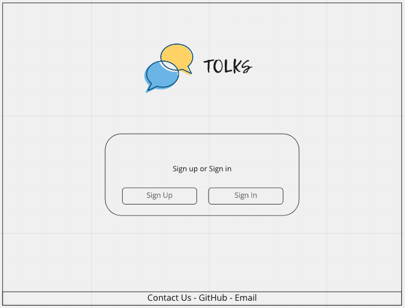
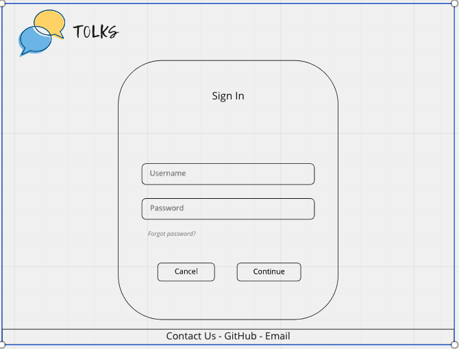
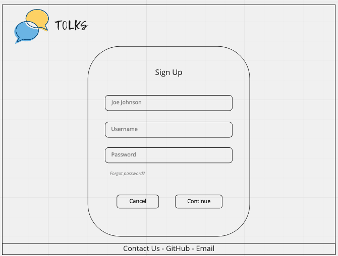
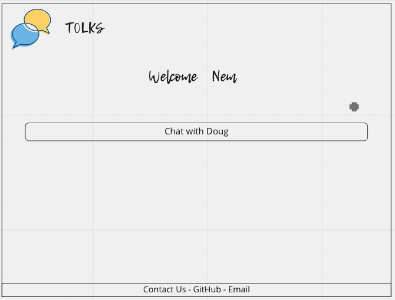
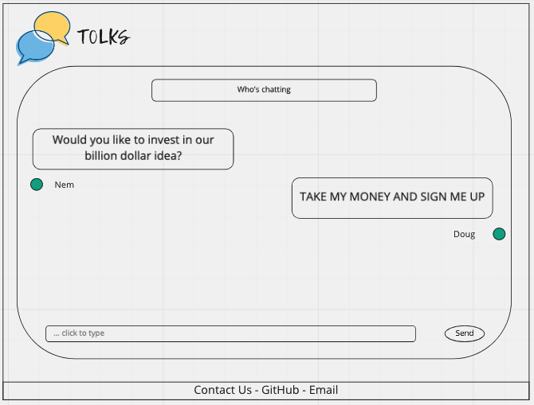

## Freedom of Dialogs!!!

<a href="https://img.shields.io/badge/JavaScipt-100%25-yellow"></a> <a href="https://img.shields.io/badge/Used-Node.js-red"></a> <a href="https://img.shields.io/badge/Used-Express-orange"></a> <a href="https://img.shields.io/badge/Used-Dotenv-blueviolet"></a> <a href="https://img.shields.io/badge/Used-Mysql2-informational"></a> <a href="https://img.shields.io/badge/Used-Sequelize-success"></a>

## Table of Contents

- [Description](#description)
- [User Story](#user-story)
- [Acceptance Criteria](#acceptance-criteria)
- [Design](#design) 
- [Installation](#installation)
- [Usage](#usage)
- [Test Instructions](#test-instructions)
- [Contribution](#contribution)
- [License](#license)
- [Authors](#authors)

## Description

This project will enable the users to securely log in to the web application and chat with other users. For this project we used new technology called websocket.

## User Story

As a business owner.I would like an secure independent communication application.So that I can communicate with my clients, follow up on potential leads, and prospects. As well as maintain the privacy of my clients and communicate with them in real time.

## Acceptance Criteria

WHEN I am presented with the home page <br />

THEN I am presented with a heading and logo, options to sign in and sign up as well as a means to contact the developers in the footer by GitHub or Email<br />

WHEN I select sign up <br />

THEN I am taken to to the sign in form and asked to enter a display name, email address and password <br />

WHEN I enter an email address that has already been used <br />

THEN I am prompted with an alert informing me that the email address has already been used <br />

WHEN I select to sign in <br />

THEN I am navigated to the sign in form which will ask for my username and password. <br />

WHEN I enter the correct username and password combination<br />

THEN I am taken to my chatroom list, where I can create new chatrooms  <br />

WHEN I click on one room <br />

THEN I am taken to the messaging interface with past messages <br />

WHEN I use the web app on my tablet <br />

THEN I get a responsive message interface <br />  

## Design

### When a user loads the webpage they will be greeted by a page with Sign in/Sign Up options. <br />


<br/>

<br/>


<br/>

### When a user log in they will be on the welcome screen with chat history

<br/>



### When a user click on specific chat history they will be taken to the chat room

<br/>



<br/>  

## Installation  

### This app can be used directly on web browser no Installation needed.
### You can find the HEROKU app below

### [CHIRPER](https://mysterious-bastion-78954.herokuapp.com/)

#### If you want to check the source code please check the steps below.

#### Mysql is needed to create database. 

#### To run this code repo in your computer, user must install Node.js. 
#### User also need the following dependencies

    * "bcrypt"
    * "connect-session-sequelize"
    * "dotenv"
    * "express"
    * "express-handlebars"
    * "express-session"
    * "mysql2"
    * "sequelize"
    * "socket.io"
#### For testing and debugging purpose the following dependencies are required

    * "nodemon"
    * "eslint"
    * "eslint-config-airbnb"
    * "eslint-config-prettier" 
    * "eslint-plugin-prettier" 
    * "prettier" 
    * "Jest"


- open terminal
- clone the repo: `https://github.com/Nem-Ajvaz/Group_Project_2`
- cd into new directory (Must be in directory to work) 
- Download all dependency package by entering `npm install`
- Create The database in Mysql shell by running `SOURCE db/schema.sql`
- Quit Mysql shell
- Then run `node seeds/seed.js` to seed the database
- Run `node server.js` to start the server


## Usage

```
Sign up to create an account and start chatting !!!
```


## Demo of APP :

  

## Test Instructions
#### For testing user must install Jest dependency in Node.js module
#### You must Download jest to conduct any test in this repo  
- Download jest in cmd by running the code `npm install jest`
- Then run: `npm run test` in console


-------------------------------------------------------------------------------------------------------------------------------------------------------
## Contributors

Ronin: Frontend Developer - Designer  

Nem: Project Manager - Scrum Master  

Tanvir: Visionary and Elon Musk of the group

If you would like to contribute to this project reach out to Authors of the project below . 


## License

<a href="https://img.shields.io/badge/License-MIT-brightgreen"></a>


## Authors  
  

**Nem Ajvaz** [Git Hub Profile](https://github.com/Nem-Ajvaz) 

  

**Ronin Hietanen** [Git Hub Profile](https://github.com/RoninHietanen)  


**Tanvir Hossain** [Git Hub Profile](https://github.com/thossain89)  


&copy; 2021 Coding Bootcamp ,University of Sydney and Trilogy Education
